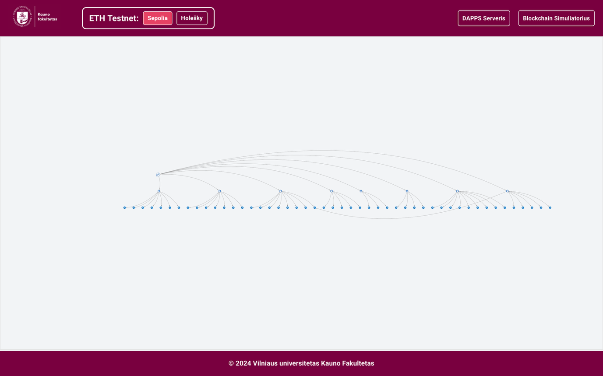
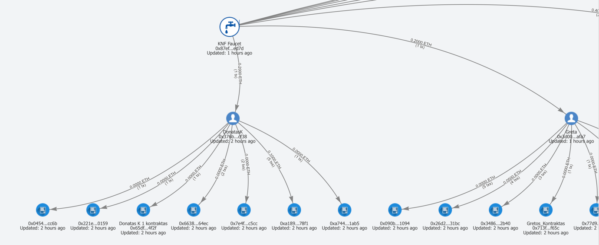

# Transaction Graph Visualizer

An interactive tool to visualize how cryptocurrency flows from faucet addresses across wallets and smart contracts.

 

## What is it?

The Transaction Graph Visualizer shows you how tokens move through a blockchain network starting from a faucet address. You can see:

- **Who received tokens** from the faucet
- **Where those tokens went next** (if recipients sent them to others)
- **Transaction patterns** over time
- **Network activity** in an easy-to-understand visual format

 

## How to Access

Visit `/graph/{network}` in your browser, where `{network}` is the blockchain network you want to explore (For example: `/graph/sepolia`).

 

## How to Use

### Basic Navigation
- **Zoom**: Use the zoom slider or +/- buttons to get a better view
- **Pan**: Click and drag empty space to move around the graph
- **Expand**: Double-click on any address to see where they sent their tokens

### Interactive Features
- **Right-click addresses** to:
  - Give them custom names (like "Alice's Wallet")
  - Copy the address to your clipboard
- **Drag nodes** to rearrange the layout - your changes are automatically saved
- **Scroll with mouse wheel** to zoom in and out

### Understanding the Graph
- **Large faucet icon**: the faucet address — the starting point
- **Wallet icon**: a regular user address
- **Contract icon**: a smart contract (never expanded — its global history is not the class')
- **Arrows**: the direction the coins flowed; the label on each arrow carries the summed amount and the number of transactions
- **"Atnaujinta"** under a node: when that address was last seen in a transaction

 

## Features

- ✅ **Real-time updates** - While viewing today, the graph refreshes automatically every 15 seconds; a past day is frozen history
- ✅ **Day slider** - Only the days the faucet itself transacted on are offered, in your local time
- ✅ **Persistent layout** - Your node arrangements are saved per network *and per day* — each day is its own graph
- ✅ **Custom naming** - Give meaningful names to addresses you recognize
- ✅ **EVM networks** - Works with every EVM network that has an `explorer` section in `_CONFIG/coins.py`

 

## Tips

- **Start with the faucet** and follow the arrows to see token distribution
- **Use zoom controls** for better visibility when there are many transactions
- **Name important addresses** to make the graph easier to read
- **Double-click nodes** to explore deeper transaction chains

 

## Technical Documentation

For developers: the code documents itself in its file headers — start at `vite/app/src/pages/Graph/Page.jsx` (the page and the day slider) and `vite/app/src/pages/Graph/hooks/useTransactionGraph.js` (fetching, sweeping and drawing); the backend side is `backend/app/evm_faucet/explorer.py` (the Etherscan cache in SQLite).

 

## Supported Networks

The visualizer works with any EVM network in `_CONFIG/coins.py` that carries an `explorer.etherscan_api_url` (the Etherscan-style API it scrapes). A network without one — Arbitrum Sepolia today — has no graph: its faucet page shows no graph button. The UTXO, SVM and Sui faucets have no graph.
