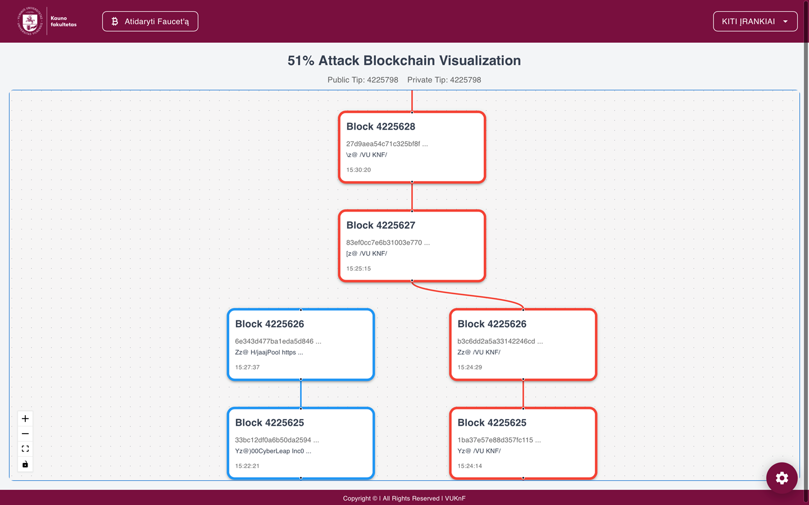
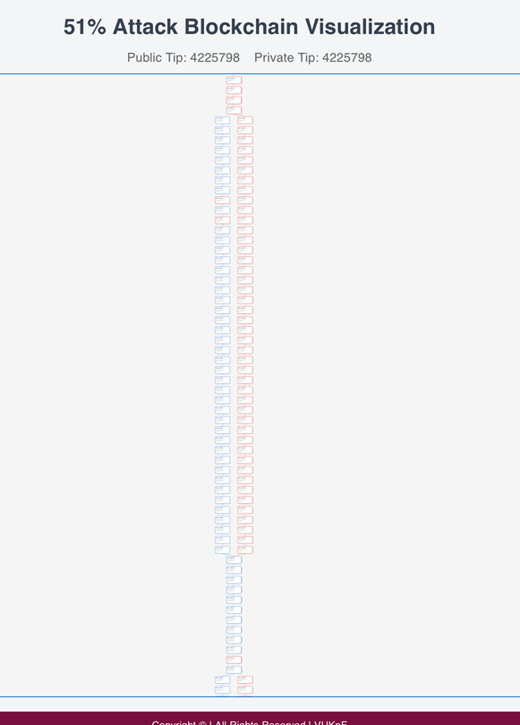
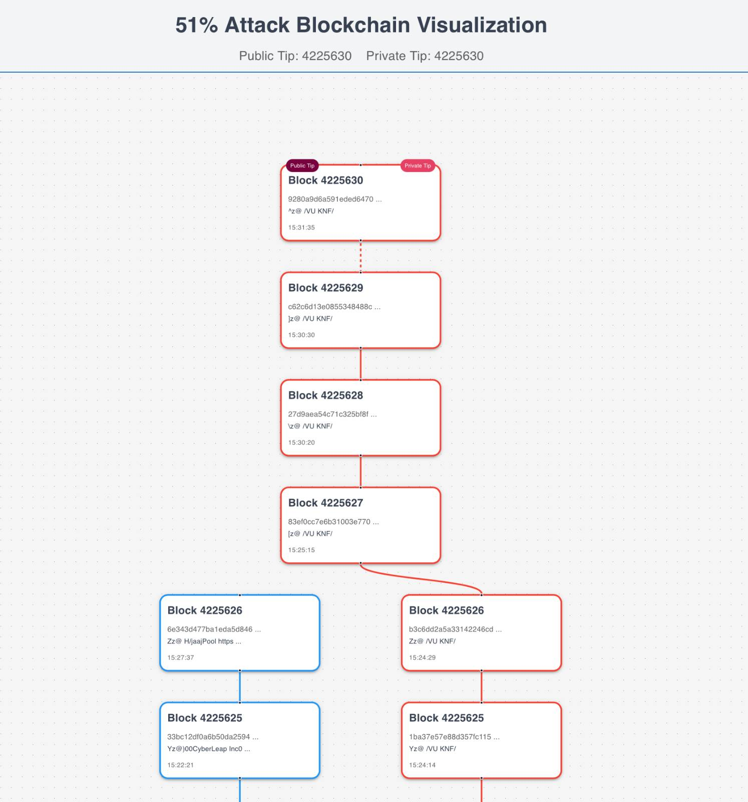

# 51% Blockchain Attack Tool

A comprehensive educational tool for demonstrating and understanding 51% attacks on blockchain networks, specifically designed for Litecoin Testnet4. This tool provides a visual interface for simulating blockchain reorganization attacks in a controlled educational environment.



## 🎯 Overview

The 51% Attack Tool is part of the Vilnius university Kaunas faculty Crypto Faucet platform, designed to educate students about blockchain security vulnerabilities. It demonstrates how an attacker with majority mining power can reorganize a blockchain and potentially double-spend transactions.

### What is a 51% Attack?

A 51% attack occurs when a single entity or group controls more than 50% of a blockchain network's mining power (hash rate). This gives them the ability to:

- **Reverse transactions** that were already confirmed
- **Double-spend coins** by creating alternative transaction histories
- **Prevent new transactions** from gaining confirmations
- **Control the blockchain** by deciding which blocks are valid

## 🏗️ Architecture

The tool operates using a sophisticated multi-node setup:

### Network Components

1. **Public Litecoin Node** (`faucet-litecoind-public`)
   - Represents the honest public blockchain
   - Connected to the real Litecoin Testnet4 network
   - Shows the legitimate blockchain state

2. **Private Litecoin Node** (`faucet-litecoind-private`) 
   - Attacker-controlled blockchain
   - Can connect/disconnect from the public network
   - Allows for independent block mining

3. **Dummy Node** (`faucet-litecoind-dummy`)
   - Bootstrap node for the private network
   - Required for private node initialization

4. **Stratum Mining Server** (`faucet-stratum`)
   - Mining pool interface on port **63333**
   - Allows external miners to connect and mine on the private chain
   - Configurable mining difficulty and rewards



## 🔧 Technical Implementation

### Backend Components

The tool consists of several Python modules in `backend/app/reorg_attack/`:

#### ReorgAttackManager (`reorg.py`)
- **Main controller** for attack operations
- Manages both public and private RPC connections
- Synchronizes blockchain data between networks
- Handles transaction tracking and visualization

#### FullNodeRPC (`fullnode_rpc.py`)
- **RPC client** for Litecoin node communication
- Provides blockchain querying capabilities
- Handles block synchronization and mining operations

#### ReorgDatabase (`reorg.py`)
- **SQLite database** for blockchain data storage
- Stores blocks, transactions, and relationship data
- Optimized for visualization and analysis

### Frontend Visualization

Built with React and ReactFlow, the frontend provides:

#### Interactive Blockchain Visualization
- **Real-time block display** showing both public and private chains
- **Color-coded blocks** (blue for honest, red for attacker)
- **Transaction tracking** with visual indicators
- **Chain tips identification** (public vs private)

#### Control Panel Features
- **Network connection toggle** (connect/disconnect from public network)
- **Raw transaction broadcasting** to private network
- **Transaction tracking** with color coding
- **Network status monitoring**



## 🚀 Getting Started

### Prerequisites
- Docker and Docker Compose installed
- Basic understanding of blockchain concepts
- External mining power for realistic attack simulation (Can be rented using MiningRigRentals.com platform)

### Accessing the Tool
1. Navigate to `/reorgattack` in your browser
2. The tool will automatically load the current blockchain state
3. Use the control panel (toggle button on the right) to manage the attack

### Basic Attack Simulation

#### Step 1: Observe Normal Operation
- Initially, both public and private nodes are synchronized
- Blocks appear in blue (honest network)
- Public and private tips should be at the same height

#### Step 2: Disconnect from Public Network
- Use the "Disconnect" toggle in the control panel
- Private node stops receiving public blocks
- Private chain can now develop independently

#### Step 3: Mine Private Blocks
- Point mining hardware to port **63333**
- Private blocks will appear in red (attacker blocks)
- Private chain develops with "VU KNF" coinbase messages

#### Step 4: Reconnect for Attack
- Once private chain is longer than public chain
- Reconnect to public network
- Watch the reorganization occur as private chain becomes dominant

## 🔬 Educational Scenarios

### Scenario 1: Double Spending Attack
1. **Create Transaction**: Send coins on public network
2. **Disconnect**: Isolate private network
3. **Mine Alternative**: Create conflicting transaction on private chain
4. **Reorganize**: Reconnect when private chain is longer
5. **Observe**: Original transaction gets reversed

### Scenario 2: Transaction Censorship
1. **Monitor Transactions**: Track specific transactions
2. **Selective Mining**: Mine blocks that exclude certain transactions
3. **Maintain Control**: Keep private chain ahead of public chain
4. **Prevent Confirmation**: Targeted transactions never confirm

### Scenario 3: Blockchain Rollback
1. **Note Current State**: Record current blockchain tip
2. **Mine Alternative History**: Create alternative blocks from earlier point
3. **Surpass Public Chain**: Make alternative chain longer
4. **Force Reorganization**: Network accepts alternative history

## 📊 Real-time Monitoring

The tool provides comprehensive monitoring capabilities:

### Network Status Display
- **Public Tip Height**: Current public blockchain height
- **Private Tip Height**: Current private blockchain height
- **Connection Status**: Whether private node is connected to public network
- **Peer Information**: Connected nodes and network activity

### Block Information
Each block displays:
- **Block Height**: Position in the blockchain
- **SHA256 Hash**: Unique block identifier (truncated for display)
- **Coinbase Message**: Block creator identification
- **Timestamp**: When the block was created
- **Transaction Indicators**: Visual markers for tracked transactions

### Transaction Tracking
- **Color-coded Transactions**: Visual distinction between different transactions
- **Cross-chain Tracking**: See which transactions appear in which chains
- **Confirmation Status**: Monitor transaction confirmations across networks

## ⚠️ Security and Ethics

### Educational Purpose Only
This tool is designed **exclusively for educational purposes** within the Vilnius university Kaunas faculty academic environment. It demonstrates:
- Blockchain security vulnerabilities
- The importance of network decentralization
- Real-world attack vectors and their impacts

### Testnet Environment
- Uses **Litecoin Testnet4** (no real value)
- Isolated network environment
- No impact on production systems
- Safe for experimental use

### Responsible Disclosure
Students using this tool should understand:
- Real 51% attacks are **illegal and unethical**
- Knowledge should be used for **defensive purposes**
- Understanding vulnerabilities helps build **more secure systems**

## 🔧 Configuration

### Mining Configuration (faucet-stratum docker container)
```yaml
REWARD_ADDR: tltc1q485fru2s4j8rgy3tvrmmf0tu0veqhlqqqrp9c8
COINBASE_MESSAGE: /VU KNF/
POOL_DIFFICULTY: 2000000
PORT: 63333
```

### RPC Settings (faucet-litecoind-xxxxx docker containers)
```yaml
RPC_USER: admin
RPC_PASSWORD: admin
RPC_PORT: 19332
```

### Network Topology
- **Public Network**: Connected to real Litecoin Testnet4
- **Private Network**: Isolated attacker-controlled chain
- **Mining Pool**: Stratum interface for external miners


## 🛡️ Defense Mechanisms

The tool also demonstrates defense strategies:

### Increased Confirmations
- Show how waiting for more confirmations increases security
- Demonstrate the cost of deeper reorganizations

### Network Monitoring
- Real-time detection of competing chains
- Alert systems for unusual mining activity

### Decentralization Importance
- Illustrate how distributed mining prevents attacks
- Show the security benefits of diverse mining pools

## 🎓 Learning Objectives

After using this tool, students should understand:

1. **Attack Mechanics**: How 51% attacks work technically
2. **Economic Incentives**: Cost vs. benefit of attacking networks
3. **Defense Strategies**: How networks protect against such attacks
4. **Real-world Implications**: Why decentralization matters
5. **Security Trade-offs**: Balance between efficiency and security


## 🐛 Troubleshooting

### Common Issues

#### Mining Connection Problems
- Verify port 63333 is accessible
- Check mining software configuration
- Ensure proper Stratum protocol implementation

#### Synchronization Issues
- Restart both public and private nodes
- Clear blockchain data if corruption suspected
- Check network connectivity

#### Visualization Problems
- Refresh browser page
- Check browser console for JavaScript errors
- Verify backend API connectivity

### Support
For technical issues or questions about the educational content, please leave an issue in the GitHub repository.

---

**⚠️ Disclaimer**: This tool is for educational purposes only. Any use of this knowledge for malicious purposes is strictly prohibited and may be illegal. Always use blockchain technology responsibly and ethically.
