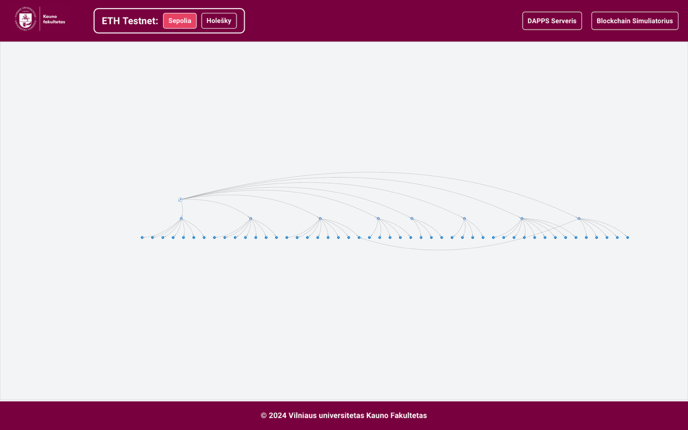
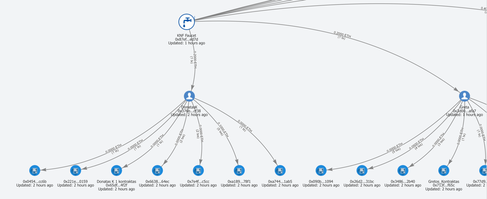

# Transaction Graph Visualizer

An interactive tool to visualize how cryptocurrency flows from faucet addresses across wallets and smart contracts.

 

## What is it?

The Transaction Graph Visualizer shows you how tokens move through a blockchain network starting from a faucet address. You can see:

- **Who received tokens** from the faucet
- **Where those tokens went next** (if recipients sent them to others)
- **Transaction patterns** over time
- **Network activity** in an easy-to-understand visual format

 

## How to Access

Visit `/graph/{network}` in your browser, where `{network}` is the blockchain network you want to explore (For example: `/graph/sepolia`).

 

## How to Use

### Basic Navigation
- **Zoom**: Use the zoom slider or +/- buttons to get a better view
- **Pan**: Click and drag empty space to move around the graph
- **Expand**: Double-click on any address to see where they sent their tokens

### Interactive Features
- **Right-click addresses** to:
  - Give them custom names (like "Alice's Wallet")
  - Copy the address to your clipboard
- **Drag nodes** to rearrange the layout - your changes are automatically saved
- **Scroll with mouse wheel** to zoom in and out

### Understanding the Graph
- **Green nodes**: The faucet address (starting point)
- **Blue nodes**: Regular user addresses
- **Yellow nodes**: Smart contracts
- **Arrows**: Show the direction tokens flowed
- **Thicker arrows**: Larger amounts or more transactions

 

## Features

- ✅ **Real-time updates** - Graph refreshes automatically every 15 seconds
- ✅ **Persistent layout** - Your node arrangements are saved per network
- ✅ **Custom naming** - Give meaningful names to addresses you recognize
- ✅ **Multi-network support** - Works with all supported blockchain networks

 

## Tips

- **Start with the faucet** and follow the arrows to see token distribution
- **Use zoom controls** for better visibility when there are many transactions
- **Name important addresses** to make the graph easier to read
- **Double-click nodes** to explore deeper transaction chains

 

## Technical Documentation

For developers and advanced users, detailed technical documentation is available in the [Graph module README](../../vite/app/src/pages/Graph/README.md).

 

## Supported Networks

The visualizer works with any EVM-compatible blockchain network configured in the system.
